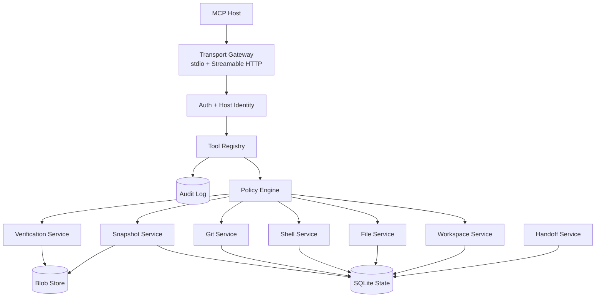

# WorkspaceGuard Implementation Design

**Status**: Draft  
**Created**: 2026-06-20  
**Last Updated**: 2026-06-20  
**Decision**: Build a new TypeScript/Node MCP runtime with explicit workspace
handles and adapter boundaries.

## Problem

The product spec defines a host-neutral MCP workspace runtime. This document
turns it into an implementation plan: repository shape, module boundaries,
runtime choices, data storage, security controls, and v0.1 delivery order.

The design must support local trusted stdio clients and remote MCP hosts such as
ChatGPT, Gemini, and Grok without making any one host the architectural center.

## Proposed Stack

| Layer | Choice | Reason |
| --- | --- | --- |
| Language | TypeScript | MCP SDK maturity, JSON schema ergonomics, host ecosystem fit |
| Runtime | Node.js 22 LTS | Stable ESM, good cross-platform process/filesystem support |
| MCP SDK | `@modelcontextprotocol/sdk` | Primary protocol implementation path |
| HTTP Server | Express or SDK HTTP adapter | Simple Streamable HTTP endpoint and OAuth middleware |
| State | SQLite | Local, transactional, easy backup and inspection |
| Storage | content-addressed files under state dir | Large snapshots and outputs should not bloat SQLite |
| Tests | Vitest or Node test runner | Fast unit and integration coverage |
| Packaging | npm package with `workspaceguard` bin | Easy use from Gemini/Claude stdio and local installs |

## Architecture



## Repository Layout

```text
.
├── docs/
│   ├── adr/
│   ├── host-profiles.md
│   ├── implementation-design.md
│   └── workspaceguard-mcp-spec.md
├── src/
│   ├── cli.ts
│   ├── config/
│   ├── mcp/
│   ├── policy/
│   ├── services/
│   ├── state/
│   ├── tools/
│   └── utils/
├── tests/
│   ├── fixtures/
│   ├── integration/
│   └── unit/
└── package.json
```

Planned module boundaries:

| Module | Owns | Does Not Own |
| --- | --- | --- |
| `mcp/` | transport setup, tool registration, JSON schemas | filesystem logic |
| `config/` | env/config files, defaults, validation | runtime policy decisions |
| `policy/` | allow/deny decisions, risk classes, approvals | raw command execution |
| `services/workspace` | workspace handles, roots, instructions | file mutation |
| `services/files` | read/search/edit/write with path containment | shell writes |
| `services/shell` | process execution, timeout, output capture | verification semantics |
| `services/git` | git status, diff, worktree, git snapshot helpers | task lifecycle |
| `services/snapshot` | snapshot/checkpoint/diff/restore | external memory |
| `services/verification` | command plans and evidence | source edits |
| `services/handoff` | resumable task summaries | model reasoning |
| `state/` | SQLite schema, migrations, blob references | business rules |

## Tool Naming

Use snake_case tool names and camelCase JSON fields:

- `workspace_open`
- `workspace_status`
- `task_start`
- `task_update`
- `task_handoff`
- `file_read`
- `file_edit`
- `file_write`
- `search_text`
- `search_files`
- `directory_list`
- `shell_run`
- `git_status`
- `git_diff`
- `snapshot_create`
- `snapshot_diff`
- `checkpoint_create`
- `checkpoint_restore`
- `drift_check`
- `verification_run`
- `verification_status`
- `policy_describe`

## State Model

SQLite tables:

- `workspaces`
- `tasks`
- `snapshots`
- `checkpoints`
- `verification_runs`
- `tool_calls`
- `observed_files`
- `approvals`
- `artifacts`

Blob store:

- command output
- large diffs
- snapshot manifests
- generated handoff documents

State IDs are server-minted and passed as ordinary tool arguments. No core
state depends on MCP protocol session headers.

## Security Controls

Required from the first implementation:

- default bind host is `127.0.0.1`
- remote HTTP requires bearer/OAuth-style auth
- HTTP validates `Origin` when present
- all paths are canonicalized before allowlist checks
- symlink escapes are denied
- shell commands have timeout and working directory containment
- command output and logs are redacted
- every tool call is recorded before and after execution
- checkpoint restore requires pre-restore snapshot
- high-risk tools require policy approval unless explicitly configured

## MVP Delivery Order

### Milestone 0: Repo Skeleton

- docs
- ADR
- package metadata
- lint/typecheck/test scripts

### Milestone 1: MCP Skeleton

- stdio server
- Streamable HTTP server
- deterministic tool list
- `healthz`
- config loading

Verification:

```bash
npm test
npm run typecheck
```

### Milestone 2: Workspace And File Tools

- `workspace_open`
- `workspace_status`
- instruction file discovery
- `file_read`
- `search_text`
- `search_files`
- `directory_list`
- `file_edit`
- `file_write`

Verification:

```bash
npm test -- workspace files policy
npm run typecheck
```

### Milestone 3: Shell, Git, And Audit

- `shell_run`
- `git_status`
- `git_diff`
- audit log
- redaction

Verification:

```bash
npm test -- shell git audit
npm run typecheck
```

### Milestone 4: Snapshots, Drift, Verification

- `snapshot_create`
- `snapshot_diff`
- `checkpoint_create`
- `drift_check`
- `verification_run`
- `verification_status`

Verification:

```bash
npm test -- snapshot drift verification
npm run typecheck
```

### Milestone 5: Host Compatibility

- Gemini CLI stdio smoke test
- Gemini CLI `httpUrl` smoke test
- Claude stdio smoke test
- Grok remote MCP smoke test through a public test tunnel
- ChatGPT remote MCP smoke test

## Alternatives Considered

### Option A: Fork Or Extend DevSpace

Pros:

- Fastest way to get local workspace MCP tools.
- Already has file/search/edit/bash and worktree concepts.
- Existing ChatGPT-facing UX ideas.

Cons:

- The core abstraction is a workspace bridge, not a task/checkpoint runtime.
- Host-neutral design would need refactoring.
- Verification, drift, restore, and handoff would be layered on after the fact.

Decision: use as reference material, not as the core.

### Option B: New TypeScript Runtime

Pros:

- Clean task/snapshot/checkpoint model.
- Best fit for MCP SDK and host compatibility.
- Clear security and audit boundaries from day one.

Cons:

- More initial implementation work.
- Must build robust file edit and shell wrappers carefully.

Decision: chosen.

### Option C: Rust Runtime

Pros:

- Strong safety and single-binary distribution.
- Good for secure filesystem/process work.

Cons:

- MCP ecosystem examples and SDK support are less direct than TypeScript.
- Slower to iterate on host compatibility and JSON schemas.

Decision: defer. Revisit if a hardened daemon becomes the main product.

## Success Metrics

| Metric | Target | Measurement |
| --- | --- | --- |
| Tool registration | deterministic across 20 starts | snapshot test |
| Path security | 100% critical fixtures pass | symlink and escape tests |
| Shell containment | no command starts outside workspace cwd | integration tests |
| Verification freshness | writes invalidate prior verification | task state tests |
| Host compatibility | 4 host profiles smoke-tested | manual plus scripted smoke tests |
| New code coverage | >=80% line coverage | coverage report |

## Risks And Mitigations

| Risk | Severity | Likelihood | Mitigation |
| --- | --- | --- | --- |
| Shell execution is too powerful | Critical | Medium | policy profiles, approval, timeout, audit, narrow roots |
| Path containment bug | Critical | Medium | canonical path helper, central tests, no ad hoc path checks |
| Host behavior differences | High | Medium | plain JSON/text outputs, host profiles, deterministic schemas |
| Snapshot restore damages user changes | High | Medium | drift check, pre-restore snapshot, approval |
| Scope expands into full agent | Medium | High | keep model reasoning outside core; adapters only |

## Open Decisions

1. Use Express directly or the MCP SDK Express helper.
   - Recommendation: SDK helper first, direct Express only if auth or host
     compatibility requires it.

2. Use Vitest or Node test runner.
   - Recommendation: Node test runner for fewer dependencies unless mocking
     becomes painful.

3. Store git snapshots as hidden refs or blob manifests.
   - Recommendation: isolated-index commit-tree snapshots for git workspaces;
     file manifests for non-git read-only diff.
