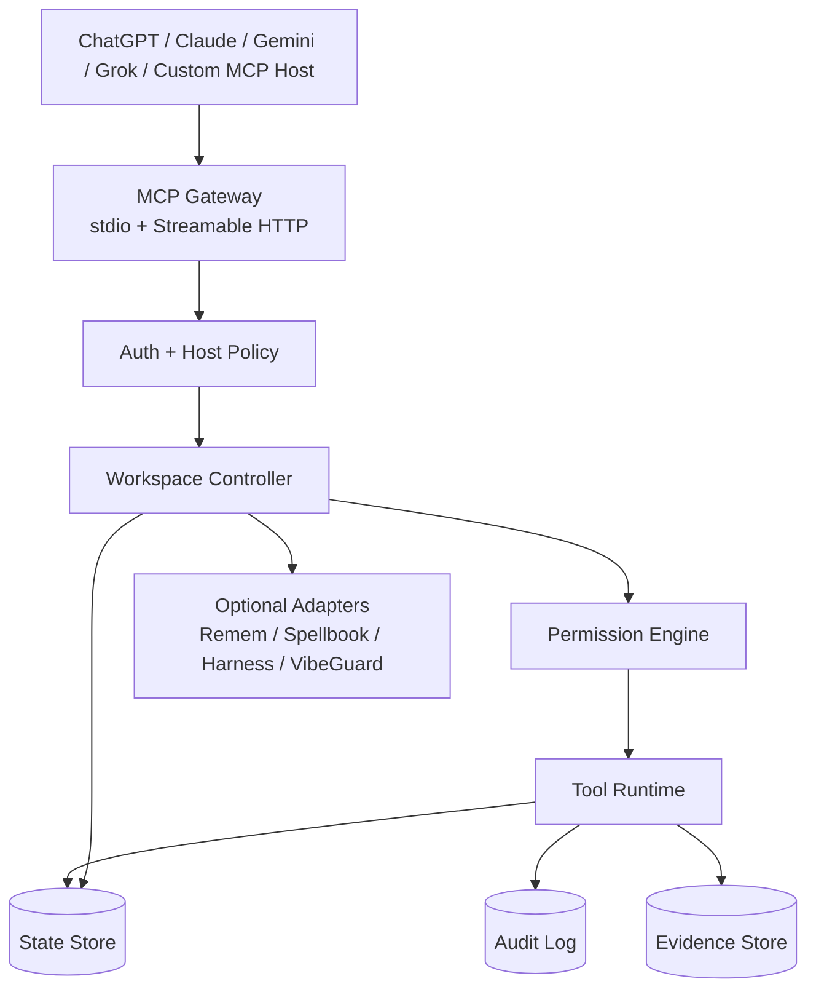
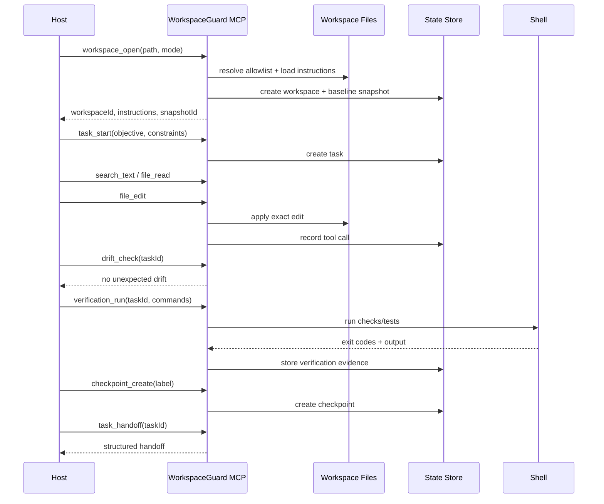

# WorkspaceGuard MCP Specification

**Status**: Draft  
**Created**: 2026-06-20  
**Last Updated**: 2026-06-20  
**Audience**: Agent infrastructure engineers, MCP host integrators, security reviewers  
**Primary Goal**: Build a host-neutral MCP workspace runtime for long-running coding agents.

## Summary

WorkspaceGuard is a structured local workspace runtime exposed over MCP. It lets
ChatGPT, Claude, Gemini, Grok, and custom agent hosts operate on real developer
workspaces through explicit, auditable tools.

The product is not "another coding agent." The host remains the reasoning agent.
WorkspaceGuard provides the controlled hands: files, search, shell, git,
snapshots, checkpoints, drift detection, verification evidence, and structured
handoff.

## Source Facts

Facts verified on 2026-06-20:

- MCP 2025-11-25 defines `stdio` and `Streamable HTTP` as standard transports.
- Streamable HTTP uses a single MCP endpoint such as `/mcp`; local servers
  should bind to localhost, validate `Origin`, and use proper authentication.
- MCP HTTP authorization is optional, but protected HTTP servers should follow
  the MCP OAuth 2.1 authorization profile and Protected Resource Metadata
  discovery.
- Gemini CLI documents MCP server configuration for `command` stdio, `url` SSE,
  and `httpUrl` Streamable HTTP.
- xAI documents Remote MCP Tools for Grok using Streaming HTTP or SSE server
  URLs, with optional authorization and headers. Grok custom connectors require
  the MCP server to be reachable from the public internet.
- MCP draft work is moving toward more stateless operation with server-minted
  handles passed as ordinary tool arguments. This spec avoids protocol-level
  session assumptions for application state.

References are listed at the end.

## Problem

Current local coding MCP servers usually expose workspace primitives directly:
read, edit, search, bash, git diff. That is useful but incomplete for serious
long-running agent work.

The missing layer is a structured workspace protocol:

- What exact workspace state did the agent start from?
- Which edits belong to which task?
- What changed since the last checkpoint?
- Can the user restore a known-good checkpoint?
- Did verification actually run in this session?
- Did local files drift while the agent was reasoning?
- Which boundaries prevent accidental edits outside the task?
- How can another host resume the task without losing context?

## Goals

- Expose local workspaces through standard MCP, not host-specific APIs.
- Support multiple MCP hosts: ChatGPT, Claude, Gemini CLI/Code Assist, Grok,
  and custom clients.
- Provide explicit workspace handles, task handles, checkpoint handles, and
  verification handles.
- Make file, shell, git, and test actions auditable.
- Support workspace snapshots, diffs, checkpoint restore, drift detection, and
  structured handoff.
- Keep dangerous actions gated by policy and approval.
- Make failure visible. No silent fallback for missing data, failed diffs,
  failed verification, or denied edits.

## Non-Goals

- Do not build a full autonomous coding agent in v1.
- Do not depend on one MCP host's proprietary UI.
- Do not treat git worktrees or path allowlists as a security sandbox.
- Do not expose broad home-directory or root filesystem access by default.
- Do not add memory, skill execution, or multi-agent orchestration into the core
  when adapters can provide those integrations.

## High-Level Design



WorkspaceGuard has four layers:

- **MCP Gateway**: standard tool/resource/prompt surface over stdio and
  Streamable HTTP.
- **Workspace Controller**: opens workspaces, creates worktrees, resolves paths,
  loads instruction files, and mints explicit handles.
- **Policy Engine**: enforces allowlists, approvals, command classes, edit
  boundaries, and host-specific scopes.
- **Runtime Services**: file/search/edit/shell/git/test execution, snapshot
  storage, drift detection, verification, and handoff.

## Host Compatibility

Tool names use `snake_case`. JSON schema fields use `camelCase` to align with
common MCP host behavior and existing MCP ecosystem examples.

| Host | Primary Connection | Required Profile | Notes |
| --- | --- | --- | --- |
| ChatGPT | Streamable HTTP `/mcp` | OAuth + public HTTPS tunnel | Optional Apps UI can be layered later. Core tools must work without UI. |
| Claude Desktop/Code | stdio or Streamable HTTP | Local stdio for trusted local use; HTTP for remote | Should not require ChatGPT-specific metadata. |
| Gemini CLI | `httpUrl` or `command` | Streamable HTTP or stdio | Avoid relying on client-side roots. Pass workspace paths via tools. |
| Gemini Code Assist | configured MCP server | host-managed MCP tool selection | Tool schemas must be concise and deterministic. |
| Grok | public MCP server URL | Streaming HTTP or SSE adapter | Public URL and auth headers are required for remote connector use. |
| Custom Host | stdio or HTTP | MCP 2025-11-25 baseline | Must pass protocol version and support tool result content. |

Compatibility rule: every core workflow must be expressible using only MCP tools
and ordinary JSON result content. Host-specific widgets are additive.

## Transport And Protocol

### Baseline

- MCP protocol baseline: `2025-11-25`.
- Primary HTTP endpoint: `/mcp`.
- Required transports:
  - `stdio` for local trusted clients.
  - Streamable HTTP for remote and cross-host clients.
- Optional compatibility transport:
  - SSE adapter for hosts that still require SSE, especially remote connector
    surfaces that have not moved fully to Streamable HTTP.

### Future-Proofing

Application state must not depend on MCP protocol sessions. WorkspaceGuard mints
explicit handles:

- `workspaceId`
- `taskId`
- `snapshotId`
- `checkpointId`
- `verificationId`
- `handoffId`

If a future MCP version removes protocol session headers, tools keep working
because all state is referenced through these handles.

## Core Concepts

### Workspace

A workspace is an allowed local directory or managed worktree.

Fields:

- `workspaceId`
- `root`
- `mode`: `checkout | worktree | container`
- `sourceRoot`
- `baseRef`
- `baseSha`
- `openedAt`
- `instructionFiles`
- `policyProfile`

### Task

A task groups changes, commands, verification, and handoff.

Fields:

- `taskId`
- `workspaceId`
- `objective`
- `constraints`
- `status`: `active | needs_input | blocked | verified | complete | abandoned`
- `createdAt`
- `updatedAt`
- `baselineSnapshotId`
- `lastCheckpointId`

### Snapshot

A snapshot captures workspace state for diff and restore.

Minimum v1 implementation:

- Git repository: commit-tree snapshot using an isolated index.
- Non-git directory: content-addressed manifest of files under allowlist.

Fields:

- `snapshotId`
- `workspaceId`
- `kind`: `git_tree | file_manifest`
- `rootHash`
- `createdAt`
- `source`: `workspace_open | checkpoint | manual | pre_restore`

### Checkpoint

A checkpoint is a named snapshot with intent.

Fields:

- `checkpointId`
- `workspaceId`
- `taskId`
- `snapshotId`
- `label`
- `reason`
- `verificationId`
- `createdAt`

### Verification

A verification run is a command or command set whose output proves a claim.

Fields:

- `verificationId`
- `workspaceId`
- `taskId`
- `commands`
- `status`: `passed | failed | timed_out | cancelled`
- `exitCodes`
- `startedAt`
- `endedAt`
- `outputRefs`

## MCP Tool Surface

### Workspace Tools

| Tool | Purpose | Risk |
| --- | --- | --- |
| `workspace_open` | Open an allowed path and return `workspaceId` plus loaded instructions. | low |
| `workspace_status` | Return current workspace, dirty state, task list, latest checkpoint. | low |
| `workspace_close` | Mark workspace handle closed. Does not delete files. | low |
| `workspace_instructions` | List and read relevant `AGENTS.md`, `CLAUDE.md`, and configured policy docs. | low |

`workspace_open` input:

```json
{
  "path": "~/work/project",
  "mode": "checkout",
  "baseRef": "HEAD",
  "policyProfile": "default"
}
```

### Task Tools

| Tool | Purpose | Risk |
| --- | --- | --- |
| `task_start` | Create task under a workspace with objective and constraints. | low |
| `task_update` | Update status, notes, blockers, or current priority. | low |
| `task_handoff` | Produce structured handoff for another host or session. | low |
| `task_complete` | Mark complete only when verification evidence exists or user overrides. | medium |

### File And Search Tools

| Tool | Purpose | Risk |
| --- | --- | --- |
| `file_read` | Read file within allowed read roots. | low |
| `file_write` | Create or fully overwrite a file. | high |
| `file_edit` | Apply exact-match edits to one file. | high |
| `file_patch` | Apply unified patch with path and hunk validation. | high |
| `search_text` | Search file contents. | low |
| `search_files` | Find paths by pattern. | low |
| `directory_list` | List directories. | low |

Policy:

- Reads may include activated skill/reference directories.
- Writes are limited to workspace root or managed worktree.
- Symlink traversal must resolve canonical paths before allowlist checks.
- New file creation must fail if a similar file exists and the caller has not
  searched first.

### Shell And Process Tools

| Tool | Purpose | Risk |
| --- | --- | --- |
| `shell_run` | Run a command in workspace. | critical |
| `process_list` | Show child processes started by WorkspaceGuard. | low |
| `process_cancel` | Cancel a running command. | medium |

`shell_run` input:

```json
{
  "workspaceId": "ws_123",
  "taskId": "task_123",
  "command": ["npm", "test"],
  "workingDirectory": ".",
  "timeoutSeconds": 300,
  "intent": "verification",
  "writesExpected": false
}
```

Rules:

- Prefer array arguments for structured commands.
- String shell commands are allowed only under `shellProfile: trusted`.
- Mutating shell commands require either explicit user approval or a task policy
  allowing them.
- Shell output is redacted before storage.
- Shell is never described as a sandbox.

### Git Tools

| Tool | Purpose | Risk |
| --- | --- | --- |
| `git_status` | Return porcelain status and branch metadata. | low |
| `git_diff` | Show diff against baseline, checkpoint, or ref. | low |
| `git_worktree_create` | Create managed worktree. | medium |
| `git_commit_create` | Create commit when explicitly requested. | high |
| `git_restore_checkpoint` | Restore workspace to checkpoint. | critical |

Rules:

- No force push tool in v1.
- Commit tools are disabled by default.
- Restore must create a pre-restore snapshot first.

### Snapshot And Drift Tools

| Tool | Purpose | Risk |
| --- | --- | --- |
| `snapshot_create` | Capture current workspace state. | low |
| `snapshot_diff` | Compare two snapshots or snapshot vs current. | low |
| `checkpoint_create` | Name a snapshot and attach task context. | low |
| `checkpoint_restore` | Restore files to checkpoint. | critical |
| `drift_check` | Detect changes outside expected task boundaries. | low |

Drift types:

- `external_file_change`: file changed since last observed read.
- `unexpected_generated_file`: new file not created by tracked tool call.
- `instruction_change`: AGENTS/CLAUDE/policy file changed.
- `dependency_lock_change`: lockfile changed outside package command.
- `verification_stale`: latest verification predates latest write.

### Verification Tools

| Tool | Purpose | Risk |
| --- | --- | --- |
| `verification_plan` | Infer project verification commands from repo files and instructions. | low |
| `verification_run` | Run configured check/test commands and store evidence. | high |
| `verification_status` | Return latest verification evidence. | low |

Default command discovery:

- Rust: `cargo check`, `cargo test`
- TypeScript: `npx tsc --noEmit`, project test script
- Go: `go build ./...`, `go test ./...`
- Python: `pytest`

The inferred commands are suggestions. The task or instruction files can
override them.

### Policy And Approval Tools

| Tool | Purpose | Risk |
| --- | --- | --- |
| `policy_describe` | Show active policy profile and denied capabilities. | low |
| `approval_request` | Ask user/owner to approve a high-risk action. | medium |
| `approval_status` | Check approval result. | low |

Approval requests must include:

- exact tool
- exact arguments or normalized command
- expected file paths
- rollback plan
- risk class

## Data Model

```mermaid
erDiagram
    WORKSPACE ||--o{ TASK : contains
    WORKSPACE ||--o{ SNAPSHOT : captures
    TASK ||--o{ CHECKPOINT : owns
    TASK ||--o{ VERIFICATION_RUN : proves
    TASK ||--o{ TOOL_CALL : records
    SNAPSHOT ||--o{ CHECKPOINT : names
    TOOL_CALL ||--o{ ARTIFACT : emits

    WORKSPACE {
      string workspaceId
      string root
      string mode
      string policyProfile
    }
    TASK {
      string taskId
      string objective
      string status
      string baselineSnapshotId
    }
    SNAPSHOT {
      string snapshotId
      string kind
      string rootHash
    }
    CHECKPOINT {
      string checkpointId
      string label
      string verificationId
    }
    VERIFICATION_RUN {
      string verificationId
      string status
      string outputRef
    }
    TOOL_CALL {
      string callId
      string toolName
      string risk
      string status
    }
```



Storage:

- SQLite for local state.
- Content-addressed blob directory for snapshots, diffs, and command outputs.
- Optional OpenTelemetry export for enterprise audit.
- Optional adapter writes to Remem for durable task summaries.

## Key Flow: Long-Running Coding Task



## Security Model

Security priority is higher than convenience.

Required controls:

- Narrow filesystem allowlist.
- Canonical path resolution before every read/write.
- Symlink escape tests.
- Origin validation for HTTP.
- OAuth 2.1 or equivalent bearer-token authorization for remote HTTP.
- Localhost binding by default.
- No hardcoded secrets.
- Environment variable redaction in logs.
- Tool-call audit log with risk class and caller identity.
- Configurable denylist for paths such as `.ssh`, `.gnupg`, `.env`, keychains,
  browser profiles, and credential stores.

Policy profiles:

| Profile | Use Case | Shell | Writes | Restore |
| --- | --- | --- | --- | --- |
| `read_only` | repo inspection | denied | denied | denied |
| `edit_workspace` | normal coding | verification commands allowed | allowed in workspace | approval required |
| `worktree_safe` | isolated coding | allowed in managed worktree | allowed in worktree | approval required |
| `trusted_owner` | local owner session | allowed | allowed | approval recommended |

## Alternatives Considered

### Option A: Extend DevSpace

Pros:

- Fastest path to working MCP workspace bridge.
- Existing local file/edit/search/bash primitives.
- Existing ChatGPT Apps-compatible diff cards.
- Existing workspace and worktree concepts.

Cons:

- Product shape remains close to "workspace bridge."
- Harder to separate core runtime from ChatGPT-oriented UX.
- Snapshot/checkpoint/verification semantics would need substantial redesign.

Decision: useful as a reference or adapter, not the recommended core unless
speed matters more than architecture.

### Option B: Build WorkspaceGuard As A New MCP Runtime

Pros:

- Clean protocol around tasks, snapshots, drift, verification, and handoff.
- Host-neutral from the start.
- Easier to enforce security and audit model.
- Direct fit with Remem, VibeGuard, Harness, and Spellbook as optional adapters.

Cons:

- Slower MVP.
- Must reimplement or wrap reliable file/edit/search/bash primitives.
- More design surface to test.

Decision: recommended.

### Option C: Wrap Existing Agent CLIs

Pros:

- Very fast prototype.
- Can reuse Codex/Claude/Gemini behavior.
- Minimal low-level workspace code.

Cons:

- Not host-neutral; one agent becomes hidden executor.
- Tool calls become less inspectable.
- Harder to enforce exact edit boundaries and evidence contracts.
- Violates the product goal: host should reason, WorkspaceGuard should execute.

Decision: reject for core. Could be an experimental adapter later.

## MVP Scope

v0.1 must include:

- Streamable HTTP `/mcp`
- stdio server
- OAuth/bearer auth for HTTP
- filesystem allowlist
- `workspace_open`
- instruction loading
- `task_start`, `task_update`, `task_handoff`
- `file_read`, `file_edit`, `file_write`
- `search_text`, `search_files`, `directory_list`
- `shell_run` with timeout and output capture
- `git_status`, `git_diff`
- `snapshot_create`, `snapshot_diff`
- `checkpoint_create`
- `drift_check`
- `verification_run`, `verification_status`
- SQLite state store
- audit log
- host compatibility examples for Gemini CLI and Grok Remote MCP

Out of MVP:

- Browser UI
- multi-agent task assignment
- cloud sync
- container sandbox
- checkpoint restore for non-git directories
- automatic commits/pushes

## Implementation Plan

### Phase 1: Protocol Skeleton

- MCP server over stdio and Streamable HTTP.
- Capability manifest and deterministic tool list.
- Config loader for roots, state dir, policy profiles, auth.
- SQLite schema and migration.
- Smoke tests with one stdio client and one HTTP client.

### Phase 2: Workspace And Files

- `workspace_open` with allowlist and instruction loading.
- File read/edit/write/search/list tools.
- Exact-edit validation and patch validation.
- Similar-file preflight check before new file creation.
- Path escape and symlink tests.

### Phase 3: Shell, Git, Snapshots

- Shell runner with timeouts, child-process tracking, redaction.
- Git status/diff.
- Git snapshot via isolated index.
- Checkpoint creation.
- Drift checks.

### Phase 4: Verification And Handoff

- Verification command inference.
- Verification evidence storage.
- Handoff document generation.
- Stale verification detection.
- VibeGuard-compatible completion contract.

### Phase 5: Host Profiles

- Gemini CLI stdio config example.
- Gemini CLI `httpUrl` config example.
- Grok remote MCP config example.
- ChatGPT/Claude config notes.
- Compatibility test matrix.

## Success Metrics

| Metric | Target | Measurement |
| --- | --- | --- |
| MCP host compatibility | 4 host profiles verified | ChatGPT/Claude/Gemini/Grok smoke tests |
| Path escape protection | 100% critical tests pass | symlink, `..`, absolute path, hidden dir tests |
| Snapshot diff correctness | 100% fixture tests pass | git and non-git fixture comparisons |
| Verification freshness | 0 false completion claims in fixtures | writes after verification mark status stale |
| Command auditability | 100% shell calls recorded | audit log assertions |
| Restore safety | pre-restore snapshot always created | restore integration tests |
| Tool list stability | deterministic order | repeated `tools/list` snapshot tests |
| New code coverage | >=80% line coverage | project coverage report |

## Risks And Mitigations

| Risk | Severity | Likelihood | Mitigation |
| --- | --- | --- | --- |
| Remote host gets shell access to local machine | Critical | Medium | OAuth, localhost default, explicit owner approval, narrow roots, command policy |
| Path allowlist bypass through symlinks | Critical | Medium | canonical path checks, symlink fixtures, denylist sensitive paths |
| Agent restores over user changes | High | Medium | drift check, pre-restore snapshot, explicit approval |
| Host-specific MCP differences break portability | High | Medium | host profiles, compatibility matrix, core tools return plain JSON/text |
| Verification evidence becomes stale | High | High | mark task stale after writes, require fresh verification before completion |
| Snapshot storage grows too large | Medium | Medium | retention policy, content-addressed dedupe, max blob size |
| Shell logs leak secrets | High | Medium | redaction, disabled command logging by default, secret scanner |
| Spec drift from MCP future changes | Medium | Medium | explicit handles, stateless-ready design, compatibility adapter layer |

## Requirements Traceability

| Requirement | Design Element | Verification |
| --- | --- | --- |
| Host-neutral MCP access | stdio + Streamable HTTP gateway | host compatibility smoke tests |
| Local workspace control | Workspace Controller | workspace open/path tests |
| Safe file editing | file tools + exact patch validation | edit/patch unit tests |
| Drift detection | snapshot and observed file tracking | drift fixture tests |
| Checkpoint restore | checkpoint model + restore tool | restore integration tests |
| Evidence verification | verification run model | stale verification tests |
| Structured handoff | task handoff tool | handoff snapshot tests |
| Auditability | tool call audit log | audit assertions |

## Open Questions

1. Should v0.1 support non-git snapshot restore, or only diff for non-git
   directories?
   - Recommendation: diff only in v0.1; restore for git workspaces first.

2. Should shell commands accept raw strings?
   - Recommendation: support raw strings only in trusted profiles; prefer array
     command form everywhere else.

3. Should memory integration write directly to Remem?
   - Recommendation: adapter only. Core writes structured handoff; Remem adapter
     imports selected summaries.

4. Should VibeGuard be a hard dependency?
   - Recommendation: no. Expose policy hooks and verification contracts that
     VibeGuard can enforce.

5. Should Grok use SSE in v0.1?
   - Recommendation: implement Streamable HTTP first; add SSE adapter only if
     required by a tested Grok connector path.

## References

- MCP Transports 2025-11-25:
  https://modelcontextprotocol.io/specification/2025-11-25/basic/transports
- MCP Authorization 2025-11-25:
  https://modelcontextprotocol.io/specification/2025-11-25/basic/authorization
- MCP Security Best Practices:
  https://modelcontextprotocol.io/docs/tutorials/security/security_best_practices
- MCP Draft Changelog:
  https://modelcontextprotocol.io/specification/draft/changelog
- Gemini CLI MCP server documentation:
  https://github.com/google-gemini/gemini-cli/blob/main/docs/tools/mcp-server.md
- xAI Remote MCP Tools:
  https://docs.x.ai/developers/tools/remote-mcp
- xAI Grok Custom Connectors:
  https://docs.x.ai/grok/connectors
